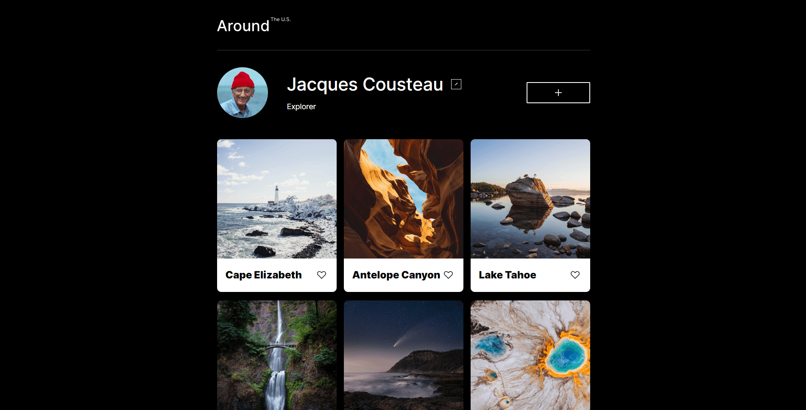
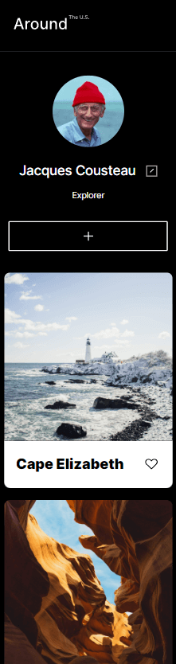

# Project 3: Around The U.S.

### Overview  

* Intro  
* Javascript Features
* GitHub Pages 
* Figma  
  
**Intro**
  
This project is made so all the elements are displayed correctly on popular screen sizes.
The website emulates a photo sharing application profile, featuring photos of locations around the United States.

**Javascript Features**

The project showcases my newfound JS knowledge. Users can adjust the name and description of the profile, like and delete cards, and even add their own cards.

All modals open with a smooth transition.

**GitHub Pages**

* [Link to the project on GitHub Pages](https://jendoc.github.io/se_project_aroundtheus/)

**Figma**  
  
* [Link to the project on Figma](https://www.figma.com/file/ii4xxsJ0ghevUOcssTlHZv/Sprint-3%3A-Around-the-US?node-id=0%3A1)  
